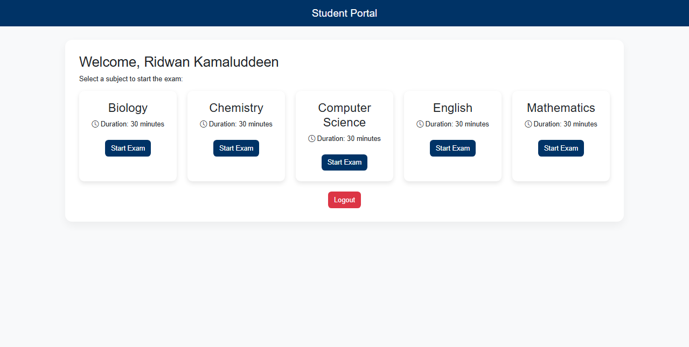

# 🧮 Computer-Based Test (CBT) System

An interactive exam system to deliver multiple-choice tests and auto-score results.

---
## 🌍 Live Demo
🔗 [Visit the Live Website](https://Stainless-aka/github.io/Computer-Based-Test-CBT-System)
---
## 🧠 Tech Stack
HTML | CSS | JavaScript | PHP (optional) | Bootstrap

---

## ✨ Features
- Timed test interface
- Multiple-choice question handling
- Automatic scoring and result display
- Question bank (JSON or DB-based)

---

## ⚙️ How to Run
1. Clone the repo.
2. Open `index.html` to run in a browser for static version.
3. For persistent storage and user tracking, host with PHP + MySQL.

---

## 📸 Screenshots

---

## 📄 License
Portfolio/demo.
